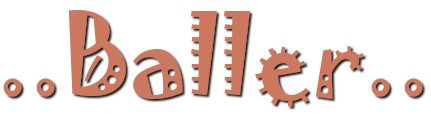

<p align="center"></p>

-----

A simple rolling ball browser based 3d game built with fun. [Play it here](https://bluemagnificent.com/lab/baller/)

## Libraries Used


* [three.js](https://github.com/mrdoob/three.js/) for the game engine
* [ammo.js](https://github.com/kripken/ammo.js/) a javascript port of [Bullet](https://github.com/bulletphysics/bullet3) physics engine
* [Comlink](https://github.com/GoogleChromeLabs/comlink) for smooth webworker communication
* [tween.js](https://github.com/tweenjs/tween.js/) for object animation
* [Proton](https://github.com/a-jie/Proton) as [three.proton](https://github.com/a-jie/three.proton) for particles
* [typed.js](https://github.com/mattboldt/typed.js/) for text animation
* and [async](https://github.com/caolan/async)

Very worthy of mention is [Ammo.lab](https://github.com/lo-th/Ammo.lab) by [lo-th](https://github.com/lo-th) from which the bridging process of threejs and ammojs was derived.


## Credits
### Textures:
`dist/assets/texture/dot.png` : gotten from three.proton project.<br>
Every other texture courtesy of [Yughues Nobiax](https://twitter.com/Yughues_Nobiax)
	
### Audio:
`dist/assets/audio/spirit-of-the-girl.ogg` : A modified form of Music from https://filmmusic.io: "Spirit of the Girl" by Kevin MacLeod (https://incompetech.com)<br>
Licence: CC BY (https://creativecommons.org/licenses/by/4.0/)


`dist/assets/audio/pulse.ogg`: Created by self<br>
Licence: CC 0 (https://creativecommons.org/publicdomain/zero/1.0/)
	

## To Run Baller
You can either dowload the repo as zip or
```
git clone git://github.com/BlueMagnificent/baller.git
```
Navigate to the project directory:<br>
```
cd ./baller
```
install dependencies:
```
npm install
```

then run it:<br>
```
npm start
```
your browser should open up with the game if every thing was successful.

## Note
You might notice slight physics anomalies, like the ball falling through the board, well... just restart the game, we'll fix that up later :stuck_out_tongue_closed_eyes:

Libraries such as tween.js, typed.js and Comnlink were added to the project as [webpack externals](https://webpack.js.org/configuration/externals/)

## ToDo
* Upgrade the RealityBridge class to become a separate project of its own (this is a todo and not a promise).
* Find a way to tackle some of the physics anomalies.

## License
MIT
